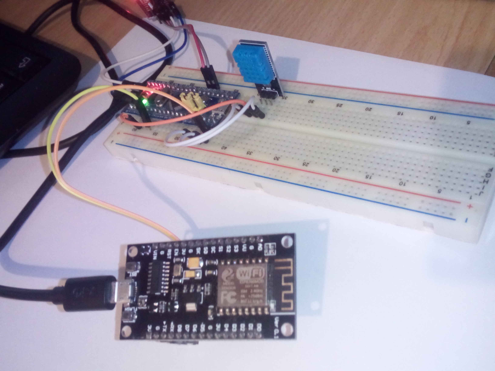
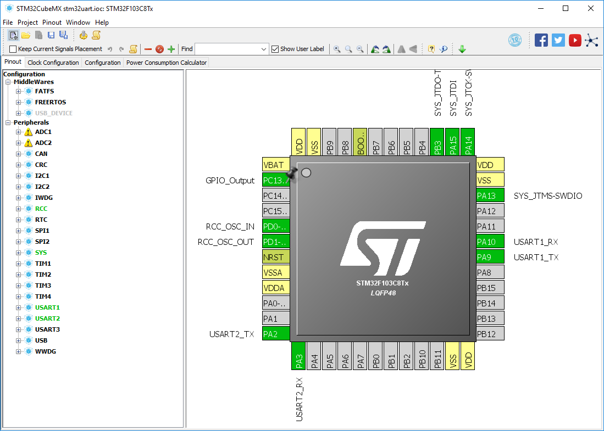

# STM32 + ESP8266 IoT using PlatformIO

## What is this project?

- a Bluepill board (STM32F103C8) reads out a DHT11 temperature and humidity sensor. 
- it transmits the values via its UART2 to the RX of the ESP8266 as a simple text string, e.g. "23,40" 
- the ESP8266 connects to a WiFi network and pushes the data to a ThingSpeak.com channel of your choice 

## Pinout

- Bluepill 
	- power (3.3V + GND)
	- DHT11 data pin to PA0
	- USART2 TX (PA2) to the RX pin (GPIO3) of the ESP8266
- ESP8266
	- power (e.g. via USB cable for the NodeMCU)
	- common GND with the STM32 board 
	- RX pin to STM32's TX pin as described above 
	

## Settings 

- ESP8266 (`settings.h`)
	- `SECRET_SSID`, `SECRET_PASS`: place your WiFi SSID and password here 
	- `SECRET_CH_ID`, `SECRET_WRITE_APIKEY`: place your channel ID and write API key from ThingSpeak here
- STM32
	- no changable macros

## Setup re-creation 

Sign up for a thingspeak.com account, create a new channel and add two fields to it. Call them "Temperature" and "Humidity". 

Format the graphs in the private view as much as you like, e.g. with °C on the y axis on time on the x axis.

Copy your "Channel ID: XXXXX" and "Write API Key" (in "API Keys") to the `.h` file as described above. Also put your correct WiFi credentials in there.

## IDE setup 

If you want to import these projects into an IDE, open your shell (`cmd.exe` or bash, ..) go into either the `esp8266` or `stm32` directory and execute the command 

```sh
pio init --ide=vscode
```

You can then import that folder in your IDE. For more IDEs, type `pio init --help`. 

## Media 






## Credits 

- Maximilian Gerhardt 
- Delay code: https://www.controllerstech.com/create-1-microsecond-delay-stm32/
- DHT11 code: https://www.waveshare.com/wiki/DHT11_Temperature-Humidity_Sensor 
- STM32 base project generated with STMicroElectronics CubeMX
